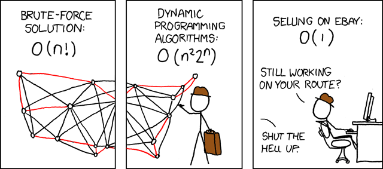

# Problemi e algoritmi

---

## Cos'è un Problema?

**Problema** = (_input_, _output_)
{: .center .large}

_Input_ = dati su cui opera il problema

_Output_ = risultati

---

## Cos'è un Problema?

**Esempio 1**: Somma di due numeri  
_Input_ = due numeri \\(a\\) e \\(b\\)  
_Output_ = la loro somma algebrica \\(a+b\\)

**Esempio 2**: Calcolo dell'ipotenusa
_Input_ = due numeri _positivi_ \\(c_1\\) e \\(c_2\\)
_Output_ = la lunghezza dell'ipotenusa di un triangolo rettangolo i cui cateti hanno lunghezza \\(c_1\\) e \\(c_2\\)

---

## Cos'è un Problema?

**Esempio 3**: "Commesso viaggiatore"
_Input_ = un insieme di città e le distanze tra di esse
_Output_ = un "tour" di tutte le città avente lunghezza minima

Fonte: [Wikimedia Commons](http://commons.wikimedia.org/wiki/File:TSP_Deutschland_3.png)
{: .smaller .note}

---

## Cos'è un Problema?

**Istanza** = particolare realizzazione degli _input_
**Soluzione** = particolare realizzazione degli _output_
{: .larger}

**Esempio**
_Problema_ = somma di due numeri
_Istanza_ = 11 e 13
_Soluzione_ = 24

---

## Cos'è un Problema?

Formalmente:

*Problema*
 ==
insieme di tutte le coppie **(Istanza, Soluzione)**
{: .center .larger}

(è una _relazione matematica_)
{: .center}

**Esempio:** Problema della somma di due numeri
\\( \\{ ((0,0), 0), ((0,1), 1), ((1,0), 1), ((1,1), 2) \ldots \\} \\)

---

## Come risolvere un problema?

Per _risolvere un problema_ abbiamo bisogno di una _funzione_
$$ f : \text{istanza} \to \text{soluzione} $$

Per **somma** è facile: \\( f(a,b) = a+b \\)

Ma per **commesso viaggiatore**?

---

## Come risolvere un problema?

Con una *ricetta*!

---

## Algoritmi

**Algoritmo** = ricetta "computazionale"

> An **algorithm** is an effective method expressed as a _finite list_ of _well-defined instructions_ for calculating a function. Starting from an initial state and initial input (perhaps empty), the instructions describe a computation that, when executed, will proceed through a _finite number_ of _well-defined_ successive states, eventually producing "output" and _terminating_ at a final ending state.

Fonte: [Wikipedia](http://en.wikipedia.org/wiki/Algorithm)
{: .smaller .note}

---

## Descrivere algoritmi

**Ricetta** della torta mantovana
_Ingredienti:_ Zucchero, uova, lievito, mandorle, farina, burro
_Preparazione:_ Per preparare la torta mantovana, ponete in una ciotola il burro a pezzetti, ammorbidito a temperatura ambiente, e lo zucchero. Montate i due ingredienti con le fruste di uno sbattitore elettrico...

Una _ricetta_ è un _algoritmo_!
(con esecutore umano)
{: .center}

Fonte: [GialloZafferano.it](http://ricette.giallozafferano.it/Torta-mantovana.html)
{: .smaller .note}

---

## Descrivere algoritmi

Come per le ricette, un algoritmo deve essere scritto in un linguaggio comprensibile dall'esecutore _senza ambiguità_.

Per descriverli _"ad alto livello"_ (comprensibili solo da persone):
linguaggi semi-formali (come **descrizione testuale**, **pseudo-codice**, **flow chart**, ...)

Algoritmi direttamente comprensibili da _computer_:
linguaggi formali (come **C**, **R**, **Python**, **Ruby**, **sql**, ...)

---

## Risolvere problemi

Risoluzione di un problema:
{: .larger}

1. Disegno/progettazione dell'algoritmo
{: .larger}
2. Implementazione in linguaggio formale
{: .larger}

Ora cominciamo dal punto 1...

---

# Disegnare algoritmi

---

## Disegnare algoritmi

Indicazioni pratiche:

1. Definire _input_ e _output_ del problema
2. Individuare esempi _significativi_ di input
3. Descrivere un'_idea generale_ di algoritmo risolutivo
4. _Verificare_ se (e come) funziona sulle istanze di esempio
5. _Dettagliare_ l'idea generale
6. _Verificare_ se (e come) funziona sulle istanze di esempio
7. Riprendere dal punto 3 o 5 se necessario
7. (Implementare in un linguaggio di programmazione)

---

## Somma di 3 numeri

**Problema:** Somma di 3 numeri
_Input:_ Tre numeri \\(x_1, x_2, x_3\\)
_Output:_ \\(r = x_1 + x_2 + x_3\\)

_Input di esempio:_ \\(5, 4, 2\\)
{: .lesserspacebefore}

_Algoritmo:_ (idea generale)
\\(r = (( x_1 + x_2 ) + x_3 ) \\)
{: .lesserspacebefore}

_Algoritmo:_ (più dettagliato)
Inizializziamo il risultato \\(r\\) uguale a \\(x_1 + x_2\\).
Poi a \\(r\\) sommiamo \\(x_3\\) e restituiamo \\(r\\).
{: .lesserspacebefore}

---

## Somma di una sequenza

**Problema:** Somma di una sequenza di numeri
_Input:_ Una sequenza \\(x_1, \ldots, x_n\\) di \\(n\\) numeri
_Output:_ \\(r = \sum_{i=1}^n x_i\\)

_Algoritmo:_ **??**

_Input di esempio:_ La sequenza \\(5, 4, 2, 1\\) di \\(n=4\\) numeri

---

## Somma di una sequenza

**Problema:** Somma di una sequenza di numeri
_Input:_ Una sequenza \\(x_1, \ldots, x_n\\) di \\(n\\) numeri
_Output:_ \\(r = \sum_{i=1}^n x_i\\)

_Algoritmo:_ (idea generale)
_"Scorriamo"_ la sequenza numero per numero e sommiamo ciascuno di essi alla _somma parziale_ precedente.

_Esempio:_ sequenza \\(5, 4, 2, 1\\)

---

## Somma di una sequenza

**Problema:** Somma di una sequenza di numeri
_Input:_ Una sequenza \\(x_1, \ldots, x_n\\) di \\(n\\) numeri
_Output:_ \\(r = \sum_{i=1}^n x_i\\)

_Algoritmo:_ (più dettagliato)
Inizializziamo il risultato \\(r\\) a 0 e un indice \\(i\\) a 1.
Se l'indice \\(i\\) è minore o uguale a \\(n\\), allora sommiamo \\(x_i\\) a \\(r\\) e incrementiamo l'indice \\(i\\) di 1.
Ripetiamo l'operazione precedente finché \\(i\\) non supera \\(n\\).
Restituiamo \\(r\\).

---

## Somma di una sequenza

**Esempio di esecuzione**
_Input:_ La sequenza \\(5, 4, 2, 1\\) di \\(n=4\\) numeri

"Tempo"  |  \\(r\\)  |  \\(i\\)
-------- | --------- | --------
  0      |    0      |   1
  1      |    5      |   
  2      |           |   2
  3      |    9      |
  4      |           |   3
  5      |    11     |   
  6      |           |   4
  7      |    12     |   
  8      |           |   5

---

## Minimo di una sequenza

**Problema:** Minimo di una sequenza di numeri
_Input:_ Una sequenza \\(x_1, \ldots, x_n\\) di \\(n\\) numeri
_Output:_ \\(m = \min \\{x_1, \ldots, x_n\\} \\)

_Algoritmo:_ **??**

_Input di esempio:_
La sequenza \\(5, 3, 4, 2, 1, 6\\) di \\(n=6\\) numeri

---

## Minimo di una sequenza

**Problema:** Minimo di una sequenza di numeri
_Input:_ Una sequenza \\(x_1, \ldots, x_n\\) di \\(n\\) numeri
_Output:_ \\(m = \min \\{x_1, \ldots, x_n\\} \\)

_Algoritmo:_ (idea generale)
"Scorriamo" la sequenza numero per numero "tenendo nota" del numero più piccolo visto finora.

_Esempio:_ sequenza \\(5, 3, 4, 2, 1, 6\\)

---

## Minimo di una sequenza

**Problema:** Minimo di una sequenza di numeri
_Input:_ Una sequenza \\(x_1, \ldots, x_n\\) di \\(n\\) numeri
_Output:_ \\(m = \min \\{x_1, \ldots, x_n\\} \\)

_Algoritmo:_ (più dettagliato)
Inizializziamo \\(m\\) a \\(x_1\\) e \\(i\\) a \\(2\\).
Se \\(i\\) è minore o uguale a \\(n\\) e \\( m > x_i \\), allora poniamo \\( m \\) uguale a \\(x_i \\).
Ripetiamo l'operazione precedente finché \\(i\\) non supera \\(n\\).
Restituiamo \\(m\\).

---

## Minimo di una sequenza

**Esempio di esecuzione**
_Input:_ La sequenza \\(5, 3, 4, 2, 1, 6\\) di \\(n=6\\) numeri

"Tempo"  |  \\(m\\)  |  \\(i\\)
-------- | --------- | --------
  0      |    5      |   2
  1      |    3      |   
  2      |           |   3
  3      |           |   4
  4      |    2      |
  5      |           |   5
  6      |    1      |
  7      |           |   6
  8      |           |   7

---

# Complessità e efficienza   (di un algoritmo)

---

## Tempo di calcolo di un algoritmo

**Tempo di calcolo** = quanti _passi elementari_ richiede per risolvere un'istanza del problema

Deve essere una funzione della *dimensione* \\(n\\) dell'istanza
(se ho più dati in input, impiegherò più tempo)

Non si considera il "numero preciso" ma l'_andamento asintotico_ all'aumentare della dimensione dell'istanza

---

## Notazione O-grande

Notazione O-grande = descrizione dell'andamento asintotico di una funzione in \\(n\\) per \\( n \to +\infty\\)

\\( f(n) = O(g(n)) \iff \exists c, n_0 : \forall n > n_0 f(n) \leq c \cdot g(n) \\)
{: .center}

* \\(g(n)\)) è un "upper bound" alla crescita di \\(f(n)\))
* Utile per "confrontare" funzioni tra loro
* Esempi:
  \\( 13n^3 + 18n^2 + 1011 = O(n^3) \\)
  \\( 8183n^2 + n^2\log n + n + 611 = O(n^2\log n) \\)

---

## Tempo di calcolo di un algoritmo

**Esempi:**
_Somma di \\(n\\) numeri_
Dimensione dell'input: \\(n\\)
Tempo di calcolo: proporzionale a \\(n\\) (formalmente \\(O(n)\\))

_Minimo di \\(n\\) numeri_
Dimensione dell'input: \\(n\\)
Tempo di calcolo: proporzionale a \\(n\\) (formalmente \\(O(n)\\))

Sono due algoritmi *lineari*!
(senza "barare", non si può fare di meglio)

---

## Tempo di calcolo di un algoritmo

Ma istanze di _uguale dimensione_ potrebbero richiedere _tempi diversi!_
{: .larger}

---

## Tempo di calcolo di un algoritmo

**Problema:** determinare se una parola contiene la lettera H.
_Input:_ una parola \\(w\\).
_Output:_ YES se \\(w\\) contiene la lettera H, NO altrimenti.
_Algoritmo:_ a partire dalla prima lettera di \\(w\\), "scorro" da sx a dx le lettere e se trovo una H mi fermo e ritorno YES. Se ho esaurito le lettere senza trovare una H, ritorno NO.

&nbsp;              |  Istanza 1       | Istanza 2
------------------- | ---------------- | ------------
_Input:_            | \\( w = \text{computer} \\) | \\( w = \text{hardware} \\)
_Soluzione:_        | NO               | YES
_Tempo di calcolo:_ | circa 8 passi    | circa 1 passo

---

## Worst-case analysis

La _complessità computazionale nel caso peggiore_ di un algoritmo è il massimo tempo di calcolo che ha l'algoritmo su un'istanza di dimensione \\(n\\).

_Caratteristiche:_

* È una stima pessimista
* Consente di confrontare due algoritmi
* È (abbastanza) facile da determinare
* È la definizione più usata di tempo di calcolo
* Fornisce "garanzie"

---

## Efficienza e andamento asintotico

Quanto posso essere grandi le istanze del mio problema per poter ottenere una soluzione in tempi ragionevoli?

(assumendo che un passo elementare richieda \\( 1 \mu s \\))
{: .smaller .center .evenlessspacebefore}

Algoritmo *efficiente* \\( \iff \\)
complessità (max.) polinomiale \\(O(n^k)\\)
{: .center}

Fonte: [Bertoni e Goldwurm, Progetto e Analisi di Algoritmi, Rapporto Interno n. 230-98, U. di Milano](http://homes.di.unimi.it/~bertoni/Algoritmi%20e%20Strutture%20Dati.pdf)
{: .small .note}

---

## Efficienza e andamento asintotico

E se comprassi un computer più potente?

Fonte: [Wikimedia Commons](http://commons.wikimedia.org/wiki/File:Transistor_Count_and_Moore's_Law_-_2011.svg)
{: .small .note}

---

## Efficienza e andamento asintotico

E se comprassi un computer più potente?

> _"Legge" di Moore_
> Le prestazioni dei processori raddoppiano ogni 18~24 mesi

Complessità | Dim. max odierna | Dim. max. fra 18~24 mesi
----------- | ---------------- | -----------------------
\\( n \\)   |     \\(n_1\\)    |      \\(2n_1\\)
\\( n^2 \\) |     \\(n_2\\)    |      \\(\sqrt{2}n_2\\)
\\( 2^n \\) |     \\(n_3\\)    |      \\( n_3 + 1\\)
\\( n! \\) |     \\(n_4\\)    |      \\( n_4 \\)

---

## Efficienza: morale della favola

Non sempre comprare PC più potenti è sufficiente, a volte bisogna farsi _"furbi"_

Commesso viaggiatore

{: .smaller .center .lessspacebefore}

Fonte: [xkcd](http://xkcd.com/399/)
{: .note .smaller}

---

# Trattabilità   (di un problema)

---

## Trattabilità

**Domanda**:
Tutti i problemi computazionali possono essere risolti con un algoritmo _efficiente_?

---

## Trattabilità

**Domanda**:
Tutti i problemi computazionali possono essere risolti con un algoritmo _efficiente_?

**Risposta**: Non si sa. Ma si suppone di no.

Dimostrarlo è uno dei problemi del millennio
("The P vs. NP problem", premio: 1mln USD)

Fonte: [Gasarch. "The P=?NP poll.", ACM SIGACT news complexity theory column 36, 2002](http://dl.acm.org/citation.cfm?id=564599)
{: .note .small}

---

## Trattabilità

Esiste una vasta classe di problemi (chiamati _problemi NP-hard_) per cui si crede che un algoritmo efficiente non esista.

Fonte: [Wikimedia Commons](http://commons.wikimedia.org/wiki/File:P_np_np-complete_np-hard.svg)
{: .note .small}

---

## Trattabilità

Molti problemi di bioinformatica sono NP-hard!

* Allineamento multiplo
* Protein folding
* Genome rearrangement
* ...

Cosa fare?

* Algoritmi di approssimazione
{: .lesserspacebefore}
* Algoritmi euristici
* Algoritmi probabilistici
* ...

---

# Computabilità   (di una funzione)

---

## Computabilità

**Domanda**:
Tutti i problemi computazionali possono essere risolti con un algoritmo?
{: .larger}

---

## Computabilità

**Domanda:**
Tutti i problemi computazionali possono essere risolti con un algoritmo?
{: .larger}

**Risposta:** No, per alcuni problemi **non esiste** un algoritmo (problemi *incomputabili*).
{: .larger}

Sono problemi *"strani"*
Esempio: *halting problem*

---

# Riassumendo...

---

## Cosa abbiamo visto?

Take home message:

* Un _problema computazionale_ è descritto dai suoi _input_ e dai suoi _output_
{: .highline}
* Un _algoritmo_ è la descrizione finita di una metodologia per calcolare l'output (soluzione) di un problema dato l'input (istanza) in un numero finito di passi
{: .highline}
* La _complessità_ di un algoritmo è il massimo numero di passi che impiega a calcolare l'output su istanze di dimensione \\(n\\)
{: .highline}

---

## Cosa abbiamo visto?

Take home message:

* Un algoritmo è _efficiente_ se ha complessità polinomiale
{: .highline}
* Un algoritmo _non efficiente_ non può risolvere istanze "grandi" (indipendentemente dalla potenza del PC)
  \\( \RightArrow \\) è meglio cercare algoritmi efficienti
{: .highline}
* _Trattabilità_: non sempre un algoritmo efficiente esiste
{: .highline}
* _Computabilità_: non sempre un algoritmo esiste
{: .highline}

---

## Risolvere un problema

Indicazioni pratiche:

1. Definire _input_ e _output_ del problema
2. Individuare esempi _significativi_ di input
3. Descrivere un'_idea generale_ di algoritmo risolutivo
4. _Verificare_ se (e come) funziona sulle istanze di esempio
5. _Dettagliare_ l'idea generale
6. _Verificare_ se (e come) funziona sulle istanze di esempio
7. Riprendere dal punto 3 o 5 se necessario
7. (Implementare in un linguaggio di programmazione)

---

## Esercizi

Problemi da formalizzare e risolvere

1. Contare il numero di vocali in una parola data
2. Contare il numero di consonanti in una parola data
3. Dire se una parola data ha almeno 5 consonanti
4. Dire se una parola data ha più consonanti o più vocali
5. Dire se una parola data è _palindroma_ (es. "ingegni")
6. Dire se una frase data è palindroma (ignorando gli spazi,
   es. "i topi non avevano nipoti")

---

## Esercizi

Problemi da formalizzare e risolvere

Data una sequenza di numeri:

1. dire se esistono due numeri la cui somma è uguale a 0
2. dire se esistono 3 numeri uguali
3. dire se è in ordine crescente
4. ordinarla in ordine crescente
5. ordinarla in ordine crescente (in un altro modo)
