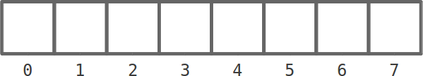
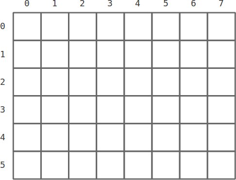
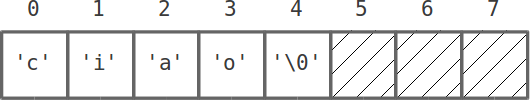

# Array in C

---

## Tipi non primitivi - Array

**Tipo non primitivo:** tipo ottenuto da altri tipi (primitivi o non) mediante costrutti di composizione resi disponibili dal linguaggio.

**Array**
{: .larger .center .lesserspacebefore}

_Sequenza di elementi aventi lo stesso tipo_ (primitivo o non).
Ogni elemento è _univocamente identificabile_ in base alla sua posizione nella sequenza.
{: .lessspacebefore}

---

## Dichiarazione di un array

_Sintassi:_

    !c
    <tipoBase> <nomeArray>[<lunghezza>];

_Semantica:_
Crea una variabile di nome `<nomeArray>` di tipo array di `<tipoBase>` di dimensione `<lunghezza>` (non inizializzato).

_Esempio:_
{: .lessspaceafter}

    !c
    int arr[10];
    double x[20];

---

## Dichiarazione con inizializzazione

La _dichiarazione con inizializzazione_ è:

    !c
    int vettore[10]= {};  // Azzera il vettore

    char parola[5]= {'c', 'i', 'a', 'o', '\0'};

    int riga[]= {1, 5, 0, 4, 1};

La dimensione può essere omessa perché viene dedotta dal numero di valori iniziali (`5` in questo caso).

---

## Accedere a un elemento

L'operatore `[]` consente l'accesso (per posizione) agli elementi dell'array.

_Il primo elemento è in posizione `0`!!_

    !c
    char parola[5]= {'c', 'i', 'a', 'o', '\0'};

    printf("%c\n", parola[2]);  // Stampa: a

    printf("%c\n", parola[0]);  // Stampa: c

---

## "Scorrere" un array

Per "scorrere" gli elementi di un array si usa (solitamente) un ciclo `for`

_Esempio:_
{: .lesserspacebefore .lessspaceafter}

    !c
    int riga[5]= {1, 5, 0, 4, 1};

    for (int i= 0 ; i<5 ; i++) {
        printf("Elemento %d-esimo: %d\n", i, riga[i]);
    }

_Output:_
{: .lessspaceafter}

    !c
    Elemento di posto 0: 1
    Elemento di posto 1: 5
    Elemento di posto 2: 0
    Elemento di posto 3: 4
    Elemento di posto 4: 1

---

## Assegnamento di array

L'operatore di assegnamento su variabili array è lecito ma _**non** fa quello che noi pensiamo/vorremmo!_

    !c
    int arr_A[4]= {1, 2, 3, 4};

    int arr_B[4]= arr_A;         // NO !!!

Per la **copia** di un array, dobbiamo usare un _ciclo_.

    !c
    int arr_A[4]= {1, 2, 3, 4};

    int arr_B[4];
    for (int i= 0; i<4; ++i) {
        arr_B[i]= arr_A[i];      // OK !!!
    }

---

## Array multi-dimensionali

_Sintassi:_
{: .lessspaceafter }

    !c
    int matrice[6][8] = { { 1, 2, 3, 4, 5, 6, 7, 8 },
                          { 9, 10, ... },
                          ...  };

_Memorizzazione:_ "latest index is the fastest"
{: .smaller}

{: style="width: 50%;"}

---

## Array multi-dimensionali

_Indicizzazione di elementi:_

    !c
    // Dichiarazione
    int tab[3][4]= {{ 1,  2,  3,  4},
                    { 5,  6,  7,  8},
                    { 9, 10, 11, 12}};

    // Uso/indicizzazione
    printf("%d %d\n", tab[1][3], tab[2][1]);
    // Cosa stampa?

---

## Funzioni con parametri array

Posso definire funzioni con parametri di tipo array:

    !c
    ...          // Devo specificare la lunghezza di
                 // tutte le dimensioni tranne la prima
    int somma_array(int array[], int n) {
        int somma= 0;
        for (int i= 0; i<n; ++i) {
            somma += array[i];
        }
        return somma;
    }
    ...
    int main() {
        ...
        int v[]= {5, 2, 4, 1};
        ...
        int somma= somma_array(v, l);
        ...
    }

---

# Stringhe

---

## Stringhe

**Stringhe=** array di caratteri (`char`).

    !c
    // Questa è una stringa
    char parola[5]= {'c', 'i', 'a', 'o', '\0'};

Inizializzazione "privilegiata":

    !c
    char parola[]= "ciao"; // "ciao" è una costante
                           // letterale

**Non** funziona come assegnamento!

    !c
    char parola[10]= "pippo";
    ...
    parola= "pluto";  // NO !!!

---

## Memorizzazione di stringhe

La dimensione dell'array (di `char`) specifica la **lunghezza massima** della stringa, ma posso inserirvi stringhe più corte!

    !c
    char stringa[8]= "ciao";

Per _convenzione_ ciascuna stringa è terminata con il _carattere speciale_ `'\0'`.

---

## I/O di stringhe

La `fprintf` e la `fscanf` trattano nativamente le stringhe mediante il segnaposto `%s`.

_Esempio:_

    !c
    char nome[100];

    printf("Come ti chiami? ");

    scanf("%s", nome);          // Le stringhe *non* vogliono &

    printf("Ciao, %s!\n", nome);

---

## Funzioni su stringhe

Le stringhe sono array _privilegiati_.

Header `<string.h>`: ([documentazione](http://www.cplusplus.com/reference/cstring/))

* `strlen(s)`: restituisce la lunghezza (effettiva) della stringa `s`
* `strcpy(dst, src)`: copia la stringa `src` nella stringa `dst`
* `strcat(s1, s2)`: "aggiunge" (concatena) la stringa `s2` al termine della stringa `s1`

_Attenzione alle dimensioni!!_
{: .center .larger}

---

## Funzioni su stringhe

_Esempio:_

    !c
    char s1[100]= "Ciao";
    char s2[100]= "Mario";

    int s1len= strlen(s1);
    printf("La stringa '%s' è di %d caratteri.\n", s1, s1len);

    strcat(s1, " da ");
    printf("La stringa s1 ora è '%s'\n", s1);

    strcpy(s2, "Pippo");
    printf("La stringa s2 ora è '%s'\n", s2);

    strcat(s1, s2);
    printf("La stringa s1 ora è '%s'\n", s1);

---

## Confronto di stringhe

Gli operatori relazionali `<`, `<=`, `==`, `!=`, `>=`, `>` **non funzionano** con le stringhe! (non fanno quel che vorremmo)

Si deve usare la funzione `strcmp` (header `<string.h>`):

    !c
    char s1[]= "Pippo";
    char s2[]= "Pluto";

    int cmp= strcmp(s1, s2);
    // cmp == 0 --> s1 = s2
    // cmp <  0 --> s1 < s2
    // cmp >  0 --> s1 > s2

---

## Esercizi

Scrivere un programma che legge una parola da terminale e determina se contiene più lettere `'a'` o più lettere `'b'`.

Scrivere un programma che legge una parola da terminale e determina se è _palindroma_.

Scrivere un programma che legge una parola da terminale e determina se contiene lettere ripetute.
