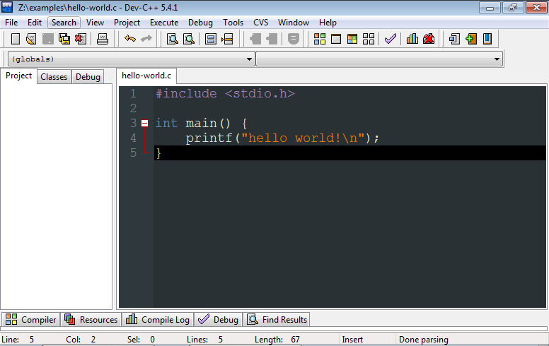

# Il linguaggio C

---

## Linguaggi formali

Un algoritmo per essere eseguito da un elaboratore deve essere codificato/implementato in un linguaggio formale

Tre livelli di astrazione:

1. _Codice macchina_
   (eseguibile dal PC, incomprensibile per noi)
2. _Linguaggio assembler_
   (quasi comprensibile dal PC,
    quasi incomprensibile per noi)
3. _Linguaggio ad alto livello_
   (non direttamente comprensibile dal PC,
    "facile" per noi)

---

## Linguaggi ad alto livello

_Linguaggio ad alto livello_: ogni istruzione del linguaggio corrisponde a **molte** istruzioni in assembler

_Esempi:_ C, C++, R, Perl, Ruby, Python, Java, ...

Due tipologie:

* Linguaggi _interpretati_ (R, Perl, Ruby, Python, Java, ...)
* Linguaggi _compilati_ (C, C++, Fortran, ...)

---

## Interpreti e compilatori

**Interprete:**
software che legge le istruzioni del programma (=codice sorgente) e le esegue passo-passo

**Compilatore:**
software che legge il codice sorgente e lo _trasforma_ in codice macchina

---

## Linguaggi interpretati e compilati

_Linguaggi interpretati:_ maggior flessibilità, minor velocità

_Linguaggi compilati:_ minor flessibilità, maggior velocità

_Approcci "ibridi":_ compilazioni intermedie e/o just-in-time,
recuperano in velocità, mantenendo flessibilità

_C è un linguaggio compilato,_
_abbiamo bisogno di un compilatore C_
{: .center}

---

## Il compilatore C

Linux:

* il compilatore `gcc` è (spesso) installato di default

Windows:

* Diverse scelte, consiglio:
_Orwell Dev-C++_ [MinGW portable](http://sourceforge.net/projects/orwelldevcpp/files/Portable%20Releases/Dev-Cpp%205.4.1%20MinGW%204.7.2%20Portable.7z/download)
  Non richiede installazione,
  integra un _ambiente di sviluppo_
  {: .highline}
  
MacOS:

* [Apple XCode](https://developer.apple.com/xcode/)

---

## L'ambiente di sviluppo

