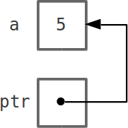
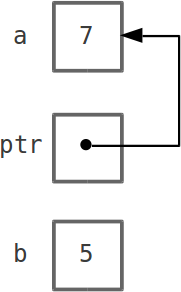

# I puntatori

---

## Tipi non primitivi - Puntatori

**Puntatore**
{: .larger .center .lessspaceafter}

Variabile che contiene l'_indirizzo_ di memoria di un'altra variabile.

_Sintassi:_
{: .lessspaceafter}

    !c
    <tipo> * <identificatore>;

_Semantica:_
Crea una variabile con nome `<identificatore>` di tipo _puntatore a `<tipo>`_.

---

## Puntatori - "indirizzo di"

L'operatore prefisso `&` (chiamato: _indirizzo di_) applicato a una _variabile_ ne restituisce l'indirizzo.

_Esempio:_

    !c
    int a= 5;
    int * ptr= &a;

{: style="position: absolute; right: 10em; top: 10em;"}

---

## Puntatori - "dereferenziamento"

L'operatore prefisso `*` (chiamato: _dereferenziamento_) applicato a un _puntatore_ ne restituisce la variabile puntata.

_Esempio:_

    !c
    int a= 5;
    int * ptr= &a;
    int b= *ptr;  // b ora vale 5

    *ptr= 7;      // a ora vale 7
                  // ptr non cambia!

{: style="position: absolute; right: 6em; top: 9em;"}

&nbsp;
L'operatore `*` si legge "la variabile puntata da".

---

## Puntatori - problemi comuni

Il simbolo `*` ha due significati:

* in una _dichiarazione_, dichiara una variabile puntatore
  (es: `int * ptr;`)
* in un'_espressione_, restituisce la variabile puntata
  (es: `*p= 10;`)

I puntatori vanno **sempre** inizializzati!!
{: .larger}

---

## Parametri in uscita

I puntatori ci consentono di scrivere funzioni che modificano il valore dei loro parametri (_parametri in uscita_).

_Esempio:_
{: .lessspaceafter}

    !c
    // Calcola le soluzioni reali di un'equazione di 2o grado
    // a x^2 + b x + c = 0

    void eq2grado(double a, double b, double c,
                  double * x1, double * x2) {

        double rad_delta= sqrt((b*b) - (4*a*c));
        *x1= (-b + rad_delta) / (2.0*a);
        *x2= (-b - rad_delta) / (2.0*a);

        // Non ritorna nulla (tipo di ritorno è void)
        // ha già "scritto" in x1 e x2
    }

---

## Parametri in uscita

I puntatori ci consentono di scrivere funzioni che modificano il valore dei loro parametri (_parametri in uscita_).

_Esempio:_
{: .lessspaceafter}

    !c
    void eq2grado(double a, double b, double c,
                  double * x1, double * x2);

    int main() {
        double a= 0.0, b=0.0, c=0.0;
        ... // Leggi a, b e c da tastiera (scanf)
        double x1= 0.0, x2= 0.0;

        eq2grado(a, b, c, &x1, &x2);
        //                ^^^^^^^^
        //       ^^^^^^^  Parametri in uscita
        //       Parametri in ingresso
        // Ora x1 e x2 contengono le due soluzioni
    }

---

## Array e puntatori

Per il compilatore, una variabile array è come un puntatore alla prima locazione dell'array.

Quindi:

    !c
    int arr[5] = { 1, 5, 3, 4, 2 };

    int * ptr= arr;  // NON vuole l'&

    ptr[2]= 500;     // ora arr vale { 1, 5, 500, 4, 2 }

---

## Array allocati dinamicamente

È possibile creare array con dimensione determinata durante l'esecuzione (a run-time).

Si usa la funzione `malloc` (header: `<stdlib.h>`)

    !c
    int n= 0;
    printf("Quanti numeri vuoi leggere? ");
    scanf("%d", &n);

    int * dynarr= (int*)malloc( n * sizeof(int) );
    //                          ^   ^^^^^^^^^^^
    //                          |   dim. del tipo base
    //                          |--numero di elementi
    // dynarr è un puntatore che può essere usato
    // come se fosse un array di n interi
    // (con n letto da tastiera)

---

## Array allocati dinamicamente

Gli array statici sono gestiti automaticamente.
Gli array allocati dinamicamente vanno gestiti **manualmente**.

Ogni `malloc` vuole la sua `free`!
{: .center .larger }

La funzione `free` (header: `<stdlib.h>`) "libera" la memoria allocata mediante una `malloc`.

---

## Ogni `malloc` vuole la sua `free`

_Esempio:_

    !c
    int n= 0;
    printf("Quanti numeri vuoi leggere? ");
    scanf("%d", &n);

    int * dynarr= (int*)malloc( n * sizeof(int) );

    ...
    // Legge i numeri e li elabora
    ...

    // Non ho più bisogno dell'array
    free(dynarr);

---

## Costruiamo una `strcat` migliore

_Esempio:_ miglioriamo la funzione `strcat`

    !c
    char* better_strcat(char* s1, char* s2) {
      // Determino la lunghezza delle due stringhe
      int s1len= strlen(s1);
      int s2len= strlen(s2);

      // Creo una nuova stringa abbastanza grande
      char* new_s1= (char*)malloc((s1len+s2len+1)*sizeof(char));

      // Copio s1 nella nuova stringa e gli accodo s2
      strcpy(new_s1, s1);
      strcat(new_s1, s2);

      // "Libero" la stringa s1 "vecchia"
      free(s1);

      // Restituisco
      return new_s1;
    }
