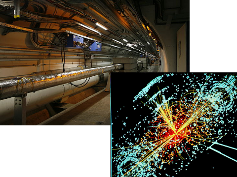
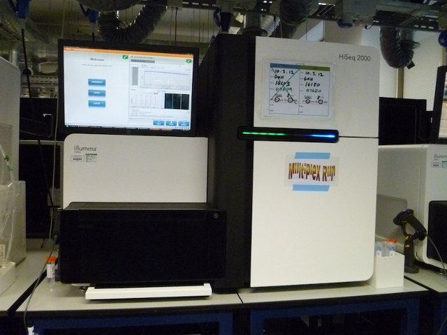
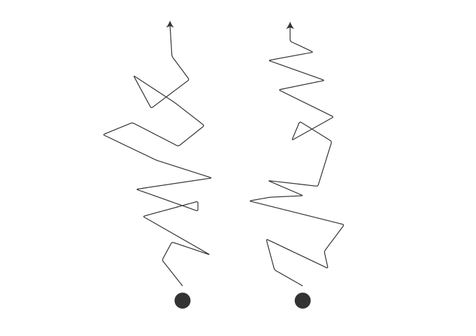
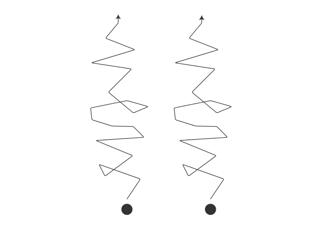
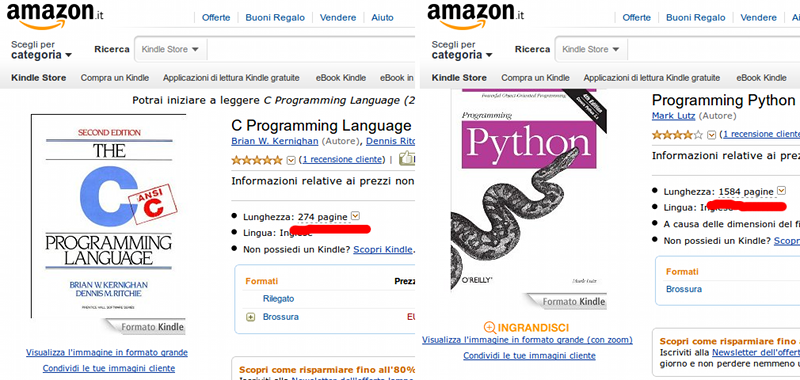
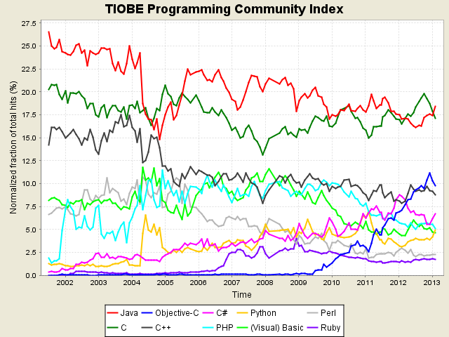

## Struttura

&nbsp;
Cosa vi aspetta...

1. Motivazioni: _Perché programmare?_ _Perché in C?_
2. Descrivere e progettare algoritmi
3. Implementare algoritmi in C
4. Un programma reale

---

# Motivazioni

---

# Programmare??

---

## LHC

27+10 TB/day (\\(\approx\\) 7800 DVD/day!!)
{: .center}

Fonte: Wikimedia Commons [1](http://commons.wikimedia.org/wiki/File:CMS_Higgs-event.jpg) [2](http://commons.wikimedia.org/wiki/File:CMS_mg_0010.jpg)
{: .smaller .note}

---

## Non solo in fisica delle particelle...

Fonte: [Wikimedia Commons](http://commons.wikimedia.org/wiki/File:HiSeq_2000.JPG)
{: .smaller .note}

---

## Interdisciplinarità

---

## Interdisciplinarità

---

# ...in C??

---

## C è (abbastanza) piccolo

---

## C è "potente" e portabile

In uso su:

* Server
* PC 
* Tablet/Smartphone
* Domestic e industrial appliance

---

## C è "stabile"

Lunga storia, poche revisioni:

* 1970: Nascita (circa)
* 1978: K&R
* 1990: C90 / Ansi C
* 1999: C99
* 2011: C11

---

## C è diffuso

Fonte: [TIOBE Programming Community Index for February 2013](http://web.archive.org/web/20130306010217/http://www.tiobe.com/index.php/content/paperinfo/tpci/index.html)
{: .note .smaller}

---

## C non è "magico"

Fonte: [Wikimedia Commons](http://commons.wikimedia.org/wiki/File:Imagemagick-logo.png)
{: .smaller .note}

---

## Però...

C **non** è un linguaggio:

* per sviluppare rapidamente applicazioni
* che aiuta a capire cosa è andato storto

Richiede _attenzione_.
{: .center .large}
